<!-- #region -->
# Lung-DDPM: Semantic Layout-guided Diffusion Models for Thoracic CT Image Synthesis

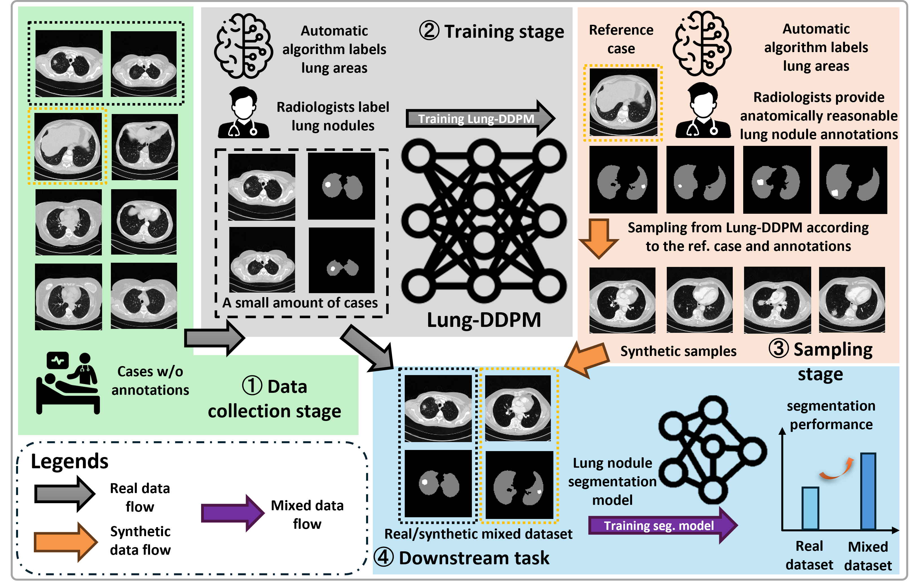

[[Preprint article](https://www.arxiv.org/abs/2502.15204)] [[Dataset & Pretrained models](https://drive.google.com/drive/folders/1IiWUsGyU-4aNN6-PscrcWijBNdjH9Qhz?usp=sharing)][[Poster](materials/poster.pdf)]

## Abstract
Pulmonary diseases, particularly lung cancer, have become major challenges for public health. Thoracic computed tomography (CT) plays a vital role in the early detection of lung cancer. With the rapid development of artificial intelligence (AI), AI-assisted medical imaging analysis has emerged, demonstrating remarkable performance across diverse medical applications. However, the costly annotation process and privacy concerns limit the construction of large-scale medical datasets, hampering the further application of AI in healthcare. To address the data scarcity in medical imaging, we propose Lung-DDPM, a thoracic CT image synthesis approach that effectively generates high-fidelity 3D synthetic CT images. These images prove helpful in downstream lung nodule segmentation tasks. Our method is based on semantic layout-guided denoising diffusion probabilistic models (DDPM), enabling anatomically reasonable, seamless, and consistent sample generation even from incomplete semantic layouts. Our results suggest that the proposed method outperforms other state-of-the-art (SOTA) generative models in image quality evaluation and downstream lung nodule segmentation tasks. Specifically, Lung-DDPM achieved superior performance on our large validation cohort, with a Fréchet inception distance (FID) of 0.0047, maximum mean discrepancy (MMD) of 0.0070, and mean squared error (MSE) of 0.0024. These results were 7.4×, 3.1×, and 29.5× better than the second-best competitors, respectively. Furthermore, the lung nodule segmentation model, trained on a dataset combining real and Lung-DDPM-generated synthetic samples, attained a dice coefficient (Dice) of 0.3914 and sensitivity of 0.4393. This represents 8.8% and 18.6% improvements in DICE and sensitivity compared to the model trained solely on real samples. The experimental results highlight Lung-DDPM’s potential for a broader range of medical imaging applications, such as general tumor segmentation, caner survival estimation and risk prediction.

## Demonstration

<table>
  <tr>
    <td align="center">
    </td>
    <td align="center">
      <strong>Ground truth</strong><br>
    </td>
    <td align="center">
      <strong>Semantic layout</strong><br>
    </td>
    <td align="center">
        <strong><a href="https://ieeexplore.ieee.org/document/10493074">Med-DDPM</a></strong><br>
    </td>
    <td align="center">
        <strong><a href="https://link.springer.com/chapter/10.1007/978-3-031-43999-5_56">Make-A-Volume</a></strong><br>
    </td>
    <td align="center">
        <strong><a href="https://arxiv.org/abs/2403.12852">GEM-3D</a></strong><br>
    </td>
    <td align="center">
        <strong> Lung-DDPM </strong><br>
    </td>
  </tr>
  <tr>
    <td align="center">
      <strong>Case 1</strong><br>
    </td>
    <td align="center">
      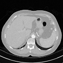
    </td>
    <td align="center">
      
    </td>
    <td align="center">
      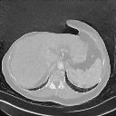
    </td>
    <td align="center">
      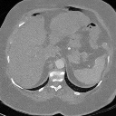
    </td>
    <td align="center">
      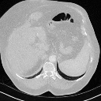
    </td>
    <td align="center">
      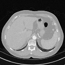
    </td>
  </tr>
  <tr>
    <td align="center">
      <strong>Case 2</strong><br>
    </td>
    <td align="center">
      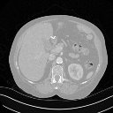
    </td>
    <td align="center">
      
    </td>
    <td align="center">
      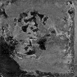
    </td>
    <td align="center">
      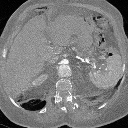
    </td>
    <td align="center">
      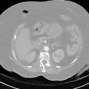
    </td>
    <td align="center">
      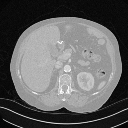
    </td>
  </tr>
</table>
<!-- #endregion -->

## Installation
```
conda env create -n lung-ddpm python=3.9
conda activate lung-ddpm
conda install pytorch==1.13.1 torchvision==0.14.1 torchaudio==0.13.1 pytorch-cuda=11.6 -c pytorch -c nvidia
pip install -r requirements.txt
```

## Preparation
We prepared three sample cases at [GoogleDrive](https://drive.google.com/drive/folders/1IiWUsGyU-4aNN6-PscrcWijBNdjH9Qhz?usp=sharing), and you can download to 'data/LIDC-IDRI/' folder. Then you can easily use a command to verify the training and sampling function.

Also, you are welcome to specify '--ct_path' and '--mask_path' parameters for your own dataset, please follow the above three cases for data formats.

Download the pretrained model at [GoogleDrive](https://drive.google.com/drive/folders/1IiWUsGyU-4aNN6-PscrcWijBNdjH9Qhz?usp=sharing). And put it at the 'checkpoints' folder in the root directory.
The directory structure should look similar as follows:
```
Lung-DDPM/
│── data/
│   ├── LIDC-IDRI/    # Prepared dataset
│   │   ├── CT/
│   │   │   ├── LIDC-IDRI-0001.nii.gz
            ...
│   │   ├── SEG/
│   │   │   ├── LIDC-IDRI-0001.nii.gz
            ...
│   ...
│── checkpoints/      # Pretrained models
│   ├── Lung-DDPM-LIDC-IDRI-100000-steps.pt
│── train.py
│── sample.py
│── README.md
...
```

## Training 
```
python train.py --ct_path "data/LIDC-IDRI/CT" --mask_path "data/LIDC-IDRI/SEG" --batchsize 1 --epochs 100000 --input_size 128 --depth_size 128 --num_class_labels 3 --num_channels 64 --num_res_blocks 1 --timesteps 250 --save_and_sample_every 2
```

## Sampling
```
python sample.py --ct_path "data/LIDC-IDRI/CT" --mask_path "data/LIDC-IDRI/SEG" --sample_path "data/LIDC-IDRI/SAMPLE" --vis_path "data/LIDC-IDRI/VIS" --input_size 128 --depth_size 128 --num_class_labels 3 --num_channels 64 --num_res_blocks 1 --timesteps 250 --batchsize 1 --num_samples 1 --num_class_labels 3 --timesteps 250 --weightfile "checkpoints/Lung-DDPM-LIDC-IDRI-100000-steps.pt" --blend_from 250
```
After the sampling process done, the sampling results will be available at 'sample_path' and the visualization results will be available at the 'vis_path'.

## To-do list
- [x] Release training and sampling code.
- [x] Release pretrained models.
- [x] Release the LIDC-IDRI patient list.
- [ ] A synthetic dataset based on LIDC-IDRI.
- [ ] HuggingFace online demo.
- [ ] Lung-DDPM+: we are working on an efficient version of Lung-DDPM. The code will be available soon. Stay tuned!

## Citation
If Lung-DDPM contributes to your research, please cite as follows:
```
@misc{jiang2025lungddpmsemanticlayoutguideddiffusion,
      title={Lung-DDPM: Semantic Layout-guided Diffusion Models for Thoracic CT Image Synthesis}, 
      author={Yifan Jiang and Yannick Lemaréchal and Josée Bafaro and Jessica Abi-Rjeile and Philippe Joubert and Philippe Després and Venkata Manem},
      year={2025},
      eprint={2502.15204},
      archivePrefix={arXiv},
      primaryClass={eess.IV},
      url={https://arxiv.org/abs/2502.15204}, 
}
```

## Acknowledgements
Lung-DDPM is developed based on the following code repositories:
1. [denoising-diffusion-pytorch](https://github.com/lucidrains/denoising-diffusion-pytorch)
2. [guided-diffusion](https://github.com/openai/guided-diffusion)
3. [Med-DDPM](https://github.com/mobaidoctor/med-ddpm)
4. [HA-GAN](https://github.com/batmanlab/HA-GAN)

We are very grateful for their contributions to the community.

